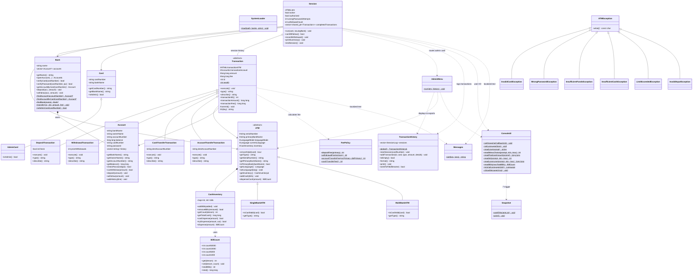

# UML Class Diagram

```mermaid
classDiagram
    %% Bank & Account hierarchy (Person A)
    class Bank {
        -string name
        -vector~Account*~ accounts
        +getName() string
        +openAccount(...) Account&
        +verifyCard(cardNumber) bool
        +verifyPassword(cardNumber, pw) bool
        +getAccountByCard(cardNumber) Account*
        +deposit(acc, amount) void
        +withdraw(acc, amount) void
        +findAccount(accountNumber)$ Account*
        +findAccountByCard(cardNumber)$ Account*
        +findBank(name)$ Bank*
        +transfer(src, dst, amount, fee)$ void
        +isAdminCard(cardNumber)$ bool
    }

    class Account {
        -string bankName
        -string ownerName
        -string accountNumber
        -long long balance
        -string cardNumber
        -string password
        -vector~string~ history
        +getBankName() string
        +getOwnerName() string
        +getAccountNumber() string
        +getBalance() long long
        +checkPassword(pw) bool
        +canWithdraw(amount) bool
        +deposit(amount) void
        +withdraw(amount) void
        +addHistory(line) void
    }

    class Card {
        -string cardNumber
        -string bankName
        +getCardNumber() string
        +getBankName() string
        +isAdmin() bool
    }

    class AdminCard {
        +isAdmin() bool
    }

    class SystemLoader {
        +load(path, banks, atms)$ void
    }

    class Snapshot {
        +setATMs(atmList)$ void
        +print()$ void
    }

    %% ATM & Session core (Person B)
    class BillCount {
        +int count50000
        +int count10000
        +int count5000
        +int count1000
        +get(denom) int
        +set(denom, count) void
        +totalBills() int
        +total() long long
    }

    class CashInventory {
        -map~int, int~ bills
        +addBills(added) void
        +removeBills(removed) bool
        +getCount(denom) int
        +getTotalCash() long long
        +canDispense(amount) bool
        +tryDispense(amount, out) bool
        +dispense(amount) BillCount
    }

    class ATM {
        <<abstract>>
        #string serialNumber
        #string primaryBankName
        #LanguageMode languageMode
        #Language currentLanguage
        #CashInventory inventory
        +isCardValid(card)* bool
        +getType()* string
        +getSerialNumber() string
        +getPrimaryBankName() string
        +isPrimaryBank(bankName) bool
        +getLanguage() Language
        +setLanguage(lang) void
        +getInventory() CashInventory&
        +addCash(bills) void
        +dispenseCash(amount) BillCount
    }

    class SingleBankATM {
        +isCardValid(card) bool
        +getType() string
    }

    class MultiBankATM {
        +isCardValid(card) bool
        +getType() string
    }

    class Session {
        -ATM& atm
        -bool active
        -bool authorized
        -int wrongPasswordAttempts
        -int withdrawalCount
        -vector~shared_ptr~Transaction~~ completedTransactions
        +run(card, issuingBank) void
        +canWithdraw() bool
        +recordWithdrawal() void
        +printSummary() void
        +endSession() void
    }

    class ConsoleUI {
        +setSnapshotCallback(cb)$ void
        +setLanguage(lang)$ void
        +readLine(prompt)$ string
        +readMenuChoice(prompt, min, max)$ int
        +readPositiveAmount(prompt)$ long long
        +readInt(prompt, min, max)$ int
        +readLongLong(prompt, min, max)$ long long
        +readBills(maxTotalBills)$ BillCount
        +promptLanguage(atm)$ Language
        +showMessage(msg)$ void
    }

    %% Transactions & Fees (Person C & Person D)
    class Transaction {
        <<abstract>>
        #ATM& transactionATM
        #Account& transactionAccount
        #long long amount
        #long long fee
        -int id
        -int nextID$
        +execute()* void
        +type()* string
        +describe()* string
        +transactionID() int
        +transactionAmount() long long
        +transactionFee() long long
        #commit() void
        #tr(key) string
    }

    class DepositTransaction {
        -bool isCheck
        +execute() void
        +type() string
        +describe() string
    }

    class WithdrawalTransaction {
        -int priorWithdrawals
        +execute() void
        +type() string
        +describe() string
    }

    class CashTransferTransaction {
        -string destAccountNumber
        +execute() void
        +type() string
        +describe() string
    }

    class AccountTransferTransaction {
        -string destAccountNumber
        +execute() void
        +type() string
        +describe() string
    }

    class FeePolicy {
        +depositFee(primary)$ int
        +withdrawalFee(primary)$ int
        +accountTransferFee(srcPrimary, dstPrimary)$ int
        +cashTransferFee()$ int
    }

    %% History, Admin, Language, Exceptions (Person D)
    class TransactionHistory {
        -vector~SessionLog~ sessions
        +global()$ TransactionHistory&
        +startSession(cardNumber) void
        +addTransaction(id, card, type, amount, details) void
        +isEmpty() bool
        +format() string
        +print() void
        +writeToFile(filename) bool
    }

    class AdminMenu {
        +run(atm, history)$ void
    }

    class Messages {
        +get(key, lang)$ string
    }

    class ATMException {
        +what() const char*
    }
    class InvalidCardException
    class WrongPasswordException
    class InsufficientFundsException
    class InsufficientCashException
    class LimitExceededException
    class InvalidInputException

    %% Relationships
    Bank *-- Account : owns
    Card <|-- AdminCard
    ATM *-- CashInventory
    ATM <|-- SingleBankATM
    ATM <|-- MultiBankATM
    CashInventory ..> BillCount : uses

    Transaction <|-- DepositTransaction
    Transaction <|-- WithdrawalTransaction
    Transaction <|-- CashTransferTransaction
    Transaction <|-- AccountTransferTransaction
    Transaction --> ATM
    Transaction --> Account
    Transaction ..> FeePolicy : calculates fee
    Transaction ..> Messages : localized text

    Session --> ATM
    Session --> Bank
    Session --> Card
    Session o-- Transaction : session history
    Session ..> AdminMenu : routes admin card
    Session ..> TransactionHistory : logs transactions
    Session ..> ConsoleUI : user I/O
    Session ..> Messages : localized text

    AdminMenu ..> TransactionHistory : displays & exports
    AdminMenu ..> ATM
    AdminMenu ..> ConsoleUI
    ConsoleUI ..> Snapshot : '/' trigger

    ATMException <|-- InvalidCardException
    ATMException <|-- WrongPasswordException
    ATMException <|-- InsufficientFundsException
    ATMException <|-- InsufficientCashException
    ATMException <|-- LimitExceededException
    ATMException <|-- InvalidInputException
```
